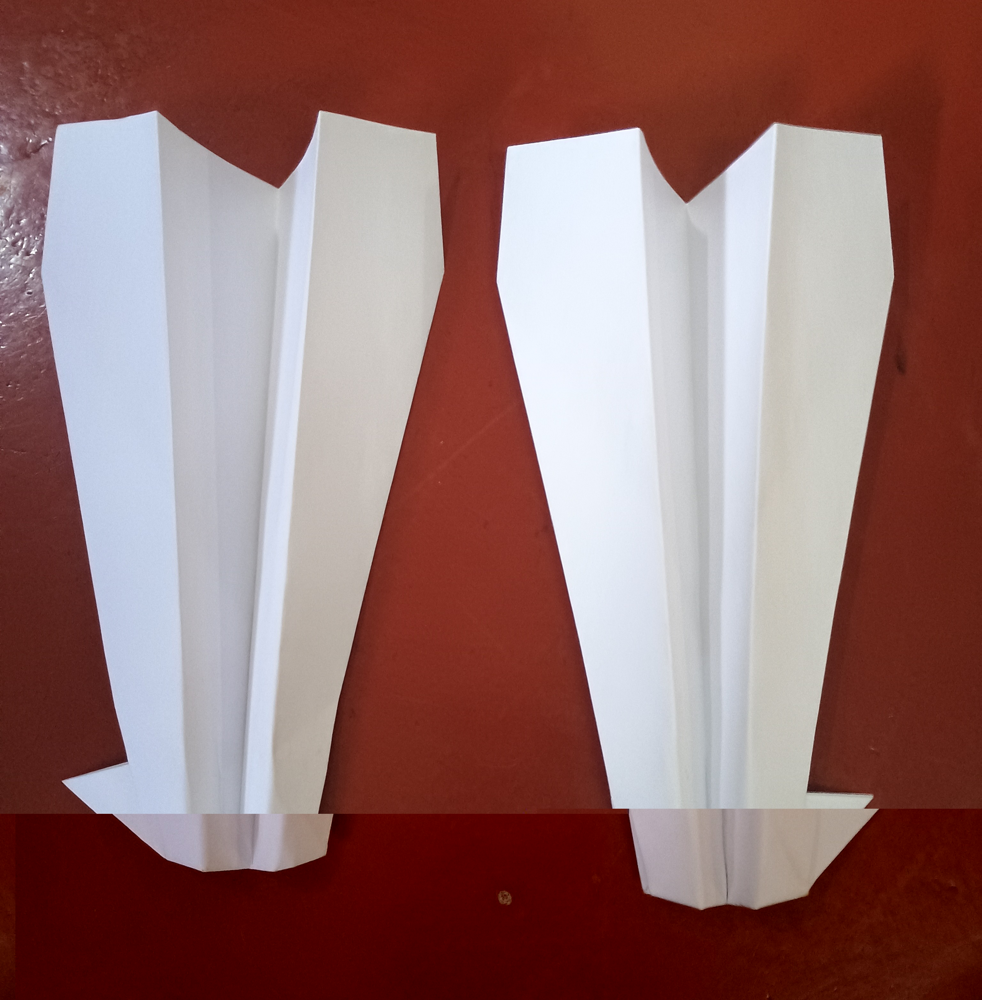

<HTML>

<head>
   <title>Paper Aeroplane Golf</title>
   <link rel="stylesheet" href="PaperAreaFormat.css">
</head>

<body>

<h1>Paper Aeroplane Golf</h1>

<h2>What is it?</h2>
   
Paper aeroplane Golf is an adaptation of the sport golf where instead of using club, golfballs, and a hole, the players use paper aeroplanes and a ring. The goal of the game is to throw a plane through the ring in the least amount of shots and have fun. It is designed soD that all the player needs is internet to access the rules and scrap items so that it is easy for everyone to play

<h2>Roles of the Planes</h2>

The game has 5 planes. The dart, the lock bottom, the canard and two modified versions of the canard. The dart is this games version of a putter, it is using for short but precise throws. The canard is a long distance plan because it is stall resistant. This allows it to glide and not come crashing to the ground easily. The rockbottom is halfway between the dart and canard's distance. You can modify the canards by folding in some one of the small wings allowing the canard to glide sideways to the throw after the original force on it.

<h2>Equipment</h2>
<ul>
   <li>A4 Paper</li>
   <li>0.5m-1m sized hoop</li>
   <li>Rope or Cord (At least 2m)</li>
</ul>

<h2>How to make the paper aeroplanes</h2>
   
The Dart: A common plane that relies on force of the throw.  - - - - - - - The Lock Bottom: A plane that uses a locked flap to keep its shape and can fly further.

   <video width="320" height="240" controls>
       <source src="Sam dart.mp4" type="video/mp4">
       You can't support MP4???
   </video>

     

   <video width="320" height="240" controls>
       <source src="Lock Bottom.mp4" type="video/mp4">
       You can't support MP4???
   </video>
 
 The Canard: A specialised plane that uses two sets of wings to resist stalling and can glide easily. - - - - Turning planes: Canards with one of their small wings folded to create more power on a side to turn it. 

<video width="320" height="240" controls>
       <source src="CanardR.mp4" type="video/mp4">
       You can't support MP4???
</video>

<h2>Adapting your planes</h2>

Planes need final touches before being ready for flight. By turning the back of the wings up, you can create a better shape for wings and by keeping have the wings in a 120 degree angle to each other helps stabilise flight. If the planes are stalling, use paper clips to reorganise weight. For example, if the plane flies straight up, put weight on the from to prevent it Turing up.

<video width="320" height="240" controls>
       <source src="WingAng.mp4" type="video/mp4">
       You can't support MP4???
   </video>
   

<h2>Setup</h2>
   
Find an area that has obstacles and plenty space and the your hoop from a tree or another object so that you can throw a plane through it. 

   <!-- Image of the set up.  For side image style="float:right;-->
   <!-- img src="Mc image.png" alt="Test 1" -->

   
Create a start point which is less than 25m away. Make sure there are obstacles in the way to avoid.

<h2>Gameplay</h2>
   
The game uses the rules of golf. You choose a plane to throw, throw it, go to where it lands and repeat the process until you have scored. You cannot throw again if you messed up and must throw from where the plane landed. If the plane lands in an area out of bounds or in a tree, move it to the closest spot which you are playing in. It may be obvious but remember don't play when it's wet!

<h2>Scoring</h2>

Like golf it is scored through par. Par is the amount of throws a hole is expected to take and you score how much you did compared to it. If you used an extra throw, you get 1 point, if you use less, you lose points. The goal is to have the least amount of points. Please play with another person so you can compete and play the same holes. 

<h2>Par Calculator</h2>
    <input type="number" id="num1" placeholder="Hoop Diameter (cm)">
    <input type="number" id="num2" placeholder="Course length (m)">
    <input type="number" id="num3" placeholder="Number of obstacles">
    <button onclick="calculatePar()">Calculate</button>
    
Par: 

  

<h2>Sources</h2>

Scotland: Golf

John Collins: The paper aeroplane guy

